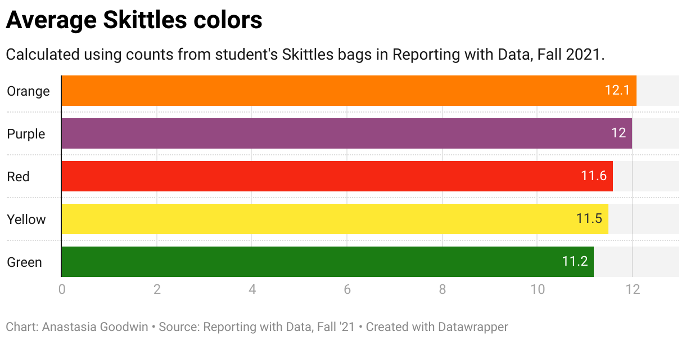

## Project Goals

- Practice making a dataset "tidy"
- Get more familiar with `ggplot`
- Use `clipr` and datawrapper to make graphics more presentable

## Setup

load in packages to tidy up our data

```{r setup, echo=T, results='hide', message=F, warning=F}
library(tidyverse)
library(janitor)
library(lubridate)
library(ggthemes)
library(clipr)
```

## Import data

Load class skittles data

```{r}
# save skittles data as new tibble
data <- read_csv("https://docs.google.com/spreadsheets/d/e/2PACX-1vTxm9NxK67thlGjYOQBo_0JRvx2d137xt0nZGffqR6P1vl8QrlTUduiOsDJ2FKF6yLgQAQphVZve76z/pub?output=csv") %>% clean_names()

# peek at the data
data %>% glimpse()
```

## Fix Dates

Change the dates from characters to real dates using `lubridate`

```{r dates}
skittles <- data %>% 
  mutate(
    date_entered = mdy_hms(timestamp) %>% date() #use lubridate to change timestamp str to actual timestamp, save as new column
  ) %>% 
  select(-timestamp) # use select to get rid of old timestamp column

skittles %>% glimpse()
```

## Pivot data

Change our data shape from a "wide" to a "long" table to work better for our plotting purposes

```{r long_table}
skittles_long <- skittles %>% 
  pivot_longer(
    cols = red:purple,
    names_to = "color",
    values_to = "candies"
  )

# take a look
skittles_long %>% head()
```
## Average color counts

Use `group_by` and `summarise` to get the average counts for each color

```{r averages}
skittles_avg <- skittles_long %>% 
  group_by(color) %>% 
  summarise(
    avg_candies = mean(candies)
  ) %>% 
  mutate(
    avg_candies = round(avg_candies, 1),
    color = str_to_title(color)
  ) %>% 
  arrange(avg_candies %>% desc())

skittles_avg
```
## Chart the color averages

Plot our avg skittles data using `ggplot2`. Then, make it prettier by applying a theme!

```{r plot_avg}
avg_plot <- ggplot(skittles_avg, aes(x = reorder(color, avg_candies), y = avg_candies)) +
  geom_col() +
  geom_text(aes(label = avg_candies), hjust = 2, color = "white") +
  coord_flip() + # Flip it so it's more readable
  labs(
    title = "Average colors per bag",
    subtitle = "Calculated from student Skittles bags in Reporting with Data",
    caption = "By Ana Goodwin",
    x = "Colors",
    y = "Average amount per bag"
  ) +
  theme_solarized()

avg_plot
```

## Datawrapper

Get data to use for datawrapper

```{r datawrapper}
# add data from skittles long to clipboard
skittles_avg %>% write_clip(allow_non_interactive = T)
```

### Datawrapper chart link

Find my published datawrapper chart [here](https://datawrapper.dwcdn.net/tWEcS/1/)


But why not just embed the chart as well?

{width=800px}


## Bonus questions

Let's answer the following questions for some additional points:
- Who got the least amount of Skittles in their bag?
- Who got the most amount of Skittles in their bag?
- What is the average number of candies in each bag?

### Least Skittles

Unfortunately it looks like Jimena Pinzon got the least amount of Skittles in their bag -- Sorry about that, Jimena.

```{r least_skittles}
skittles_long %>% 
  group_by(name) %>% 
  summarise(total_skittles = sum(candies)) %>% 
  slice(which.min(total_skittles)) # Find min row
```

### Most Skittles

Looks like Mikayla Mondragon was the lucky recipient of a whopping 69 Skittles in her bag. 

```{r most_skittles}
skittles_long %>% 
  group_by(name) %>% 
  summarise(total_skittles = sum(candies)) %>% 
  slice(which.max(total_skittles)) # Find max row
```

### Average Skittles per bag

Looks like `58.4` is the average number of Skittles in a bag

```{r avg_skittles}
skittles_long %>% 
  group_by(name) %>% 
  summarise(total_skittles = sum(candies)) %>% 
  summarise(average_skittles = mean(total_skittles)) %>% 
  mutate(
    average_skittles = round(average_skittles, 1)
  )
```